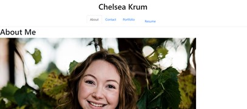
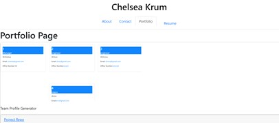

# React-Portfolio

## Description
The React-Portfolio is a website that displays my web development portfolio. It displays my name at the top with four pages in the navigation bar. The pages are "about", "contact", "portfolio", and "resume". The about page displays a photo of me and a discription of my webdevelopment background. The Cotact page displays a form to contact me. The portfolio page shows some of my past work with link and photos to these pages. The Resume page shows a link to my resume and a list of my skills Additionally, the footer has a link to my github, linkedin, and instagram.

## Installation
link to website: https://ckrum21.github.io/React-Portfolio/
link to GitHub: https://github.com/ckrum21/React-Portfolio

Install this website by cloning the code to your local devices.

software required to download this website:
* GitBash or other terminal
* Visual Studio Code

## Usage

The code used for this webpage is HTML, CSS, Javascript, and React

## Credits

Chelsea Krum 